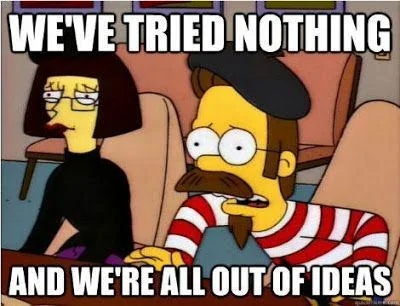

---
hide:
  - navigation
  - toc
---

# Home

{ align=right }

- Do you work in the telco/ISP industry?
- Have you tried nothing, and you're all out of ideas?

If so, this page will help you actually troubleshoot a problem, and whether or not you should _really_ escalate that issue to engineering.

For any hurt feelings or concerns, please forward your concerns to ඞ.

For Support engineers and other customer support facing roles, this page exists to help you improve your skills, serve your customers better and drive your senior engineers slightly less crazy. While you're here, bask in my signature "is this guy joking or is he really this intolerable?" style of humour (I'm sure you're thinking of a far less polite way to describe it).

For my industry peers and colleagues this exists for your entertainment and to make fun of all the things I get wrong - because where would the fun be if we were right all the time right?

My name is Jacob Bisby, and I am a Service Provider Network Architect & Engineer* based in Australia.
*_I also do a-lot of Systems Engineering and VoIP Engineering._
